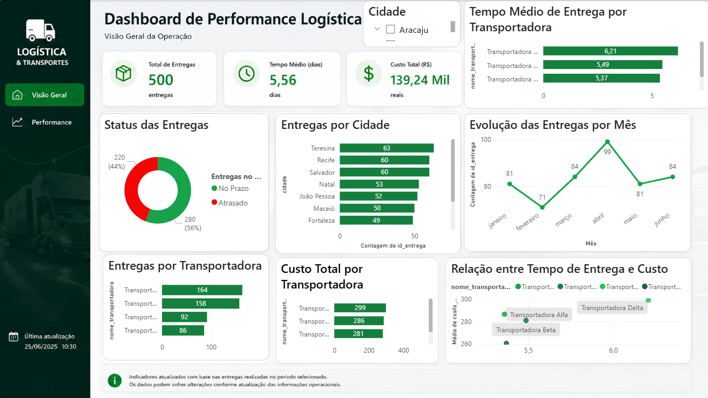

# Dashboard Logística Power BI + PostgreSQL

Dashboard desenvolvido para análise logística e transporte utilizando Power BI conectado ao PostgreSQL.

## Objetivos

* Monitorar desempenho das entregas
* Acompanhar custos logísticos
* Avaliar indicadores operacionais
* Apoiar tomada de decisão baseada em dados

## Tecnologias Utilizadas

* Power BI
* PostgreSQL
* SQL
* Modelagem de Dados

## Dashboard

## Principais Indicadores

* Total de Entregas
* Custo Logístico
* Tempo Médio de Entrega
* Status das Entregas
* Análise por Região

## Autor

Tiago Leite

Tecnólogo em Análise e Desenvolvimento de Sistemas
